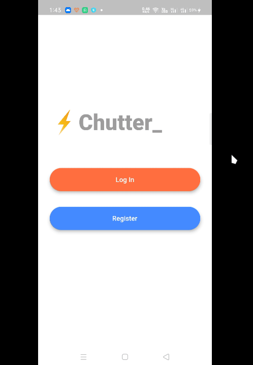

# Chutter :zap:

Chutter is a chat application written in [flutter](https://flutter.dev/) with [Firebase](https://firebase.google.com/) as backend.

## Demo:

## What I Learned:

- Creating **responsive UI** that doesn't break on different screen sizes.
- **Animations**
- **Firebase Auth** for authenticating the users.
- **Firebase Firestore** as a backend in flutter.

## TODO:

- Use **Provider** for state management.
- Create user feedback for user not registered while logging in with firebase.
- Create a list of users for the welcome screen.
- Push **notifications** on new message.
